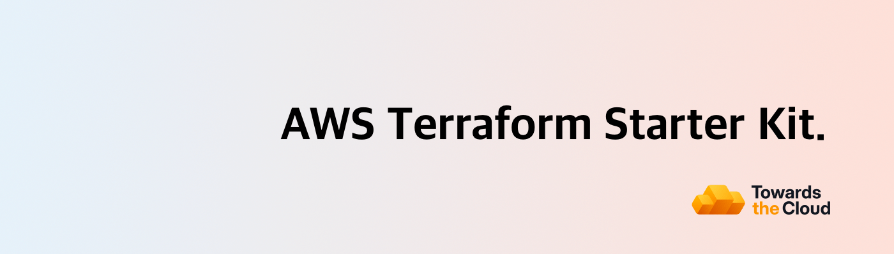

# [](https://towardsthecloud.com)

# AWS Terraform Starter Kit

[](https://aws.amazon.com/)
[](https://www.terraform.io/)
[](https://github.com/terraform-linters/tflint)
[](https://www.checkov.io/)

A production-ready AWS Terraform starter kit featuring secure OIDC authentication, automated CI/CD pipelines, multi-environment support, and comprehensive security scanning. Get your infrastructure up and running in minutes with best practices baked in.

## 🚀 Features

- **⚡ One-Command Bootstrap**: Single command automatically sets up your entire infrastructure pipeline
  - Creates S3 bucket with native state locking (Terraform 1.10+)
  - Generates environment-specific Terraform configurations
  - Provisions OIDC provider for secure keyless authentication
  - Auto-generates GitHub Actions workflows for CI/CD
- **💬 PR Plan Comments**: [Terraform plan outputs](https://github.com/marketplace/actions/terraform-plan-pr-commenter) are automatically posted to your pull requests for easy infrastructure change reviews
- **🛡️ Built-in Security**: TFLint and Checkov are integrated in the pipeline to catch issues before you deploy to AWS

<!-- TIP-LIST:START -->
> [!TIP]
> **Stop AWS bill surprises from happening.**
>
> Most infrastructure changes look harmless until you see next month's AWS bill. [CloudBurn](https://cloudburn.io) prevents this by analyzing the cost impact of your Terraform changes directly in GitHub pull requests, catching expensive mistakes during code review when fixes are quick, not weeks later when they're costly and risky.
>
> <a href="https://github.com/marketplace/cloudburn-io"></a>
>
> <details>
> <summary>💰 <strong>Set it up once, then never be surprised by AWS costs again</strong></summary>
> <br/>
>
> 1. **First install the free [Terraform Plan PR Commenter GitHub Action](https://github.com/marketplace/actions/terraform-plan-pr-commenter)** in your repository where you build your AWS Terraform infrastructure
> 2. **Then install the [CloudBurn GitHub App](https://github.com/marketplace/cloudburn-io)** on the same repository
>
> **What happens now:**
>
> Whenever you open a PR with infrastructure changes, the GitHub Action comments with your Terraform plan analysis. CloudBurn reads that plan and automatically adds a separate comment with a detailed cost report showing:
> - **Monthly cost impact** – Will this change increase or decrease your AWS bill? By how much?
> - **Per-resource breakdown** – See exactly which resources are driving costs (old vs. new monthly costs)
> - **Region-aware pricing** – We pick the right AWS pricing based on the region where your infrastructure is deployed
>
> Your team can now validate cost impact alongside infrastructure changes during code review. Essentially, this shifts FinOps left where you optimize costs as you code, not weeks later when context is lost and production adjustments require more time and carry added risk.
>
> CloudBurn will be free during beta. After launch, a free Community plan (1 repository with unlimited users) will always be available.
>
> </details>
<!-- TIP-LIST:END -->

## 📋 Prerequisites

- AWS account with admin access
- GitHub account with repository admin access

**That's it!** All other tools (Terraform, AWS CLI, TFLint, Checkov) can be installed automatically with `make install-tools`.

## 🔧 Quick Start

### ⚠️ Multi-Account Best Practice

**Important**: For production use, deploy each environment to a **separate AWS account**:
- **Test** → AWS Account A (e.g., 111111111111)
- **Staging** → AWS Account B (e.g., 222222222222)
- **Production** → AWS Account C (e.g., 333333333333)

**Why?**
- Security isolation between environments
- Blast radius containment
- Compliance requirements (SOC2, ISO 27001, etc.)
- Cost separation and tracking

### Setup (3 Steps - 5 minutes)

#### 1. Copy the starter kit

1. Click the green ["Use this template"](https://github.com/new?template_name=aws-terraform-starter-kit&template_owner=towardsthecloud) button to create a new repository based on this starter kit.

#### 2. Install required tools

```bash
make install-tools  # Installs Terraform, AWS CLI, TFLint, Checkov, Granted
```

#### 3. Configure AWS Credentials

```bash
# Option A: AWS CLI
aws configure

# Option B: Granted (for multiple accounts)
assume <profile-name>

# Verify you are connected to AWS in the CLI
aws sts get-caller-identity
```

#### 4. Run Setup to provision your Terraform project

```bash
make setup
# Or: ./scripts/setup.sh
```

**What happens:**
1. ✅ Verifies prerequisites e.g. dev tools
2. ✅ Creates S3 backend with native state locking (no DynamoDB needed)
3. ✅ Provisions environment (test/staging/production)
4. ✅ Deploys OIDC provider + IAM role so you can deploy securely via GitHub
5. ✅ Generates GitHub workflow files

**Multi-Account Setup:**
```bash
# Test account
assume test-account
make setup  # Select: test

# Staging account
assume staging-account
make setup  # Select: staging

# Production account
assume prod-account
make setup  # Select: production
```

### Configure GitHub (2 minutes)

#### A. Repository Variables (Optional)

All values are embedded as defaults - only set if you want to override:
- `AWS_ACCOUNT_ID` (already hardcoded)
- `AWS_REGION`
- `TF_STATE_BUCKET`

#### B. Environment Protection (Production)

1. Go to **Settings** → **Environments** → **production**
2. Add required reviewers
3. Set deployment branches to `main` only

### Test It (1 minute)

```bash
git checkout -b test-deployment
# Make a small change to environments/test/main.tf
git add . && git commit -m "test: verify pipeline"
git push origin test-deployment
```

✅ GitHub Actions runs automatically
✅ TFLint + Checkov scan
✅ Terraform plan posted to PR
✅ Merge to deploy

## 📚 Full Documentation

For detailed information including project structure, common commands, troubleshooting, and best practices, visit the **[→ official documentation](https://towardsthecloud.com/docs/aws-terraform-starter-kit)**.

## Author

[Danny Steenman](https://towardsthecloud.com/about)

[](https://www.linkedin.com/company/towardsthecloud)
[](https://twitter.com/dannysteenman)
[](https://github.com/towardsthecloud)
