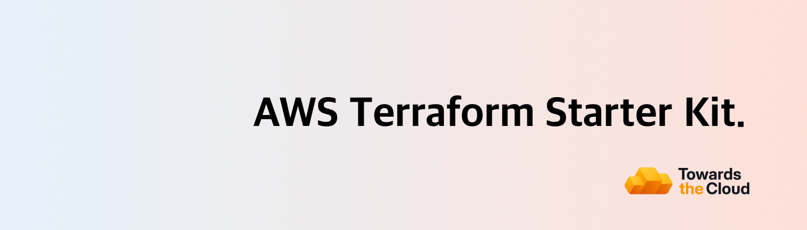

# [](https://towardsthecloud.com)

# AWS Terraform Starter Kit

[](https://aws.amazon.com/)
[](https://www.terraform.io/)
[](https://github.com/terraform-linters/tflint)
[](https://www.checkov.io/)

A production-ready AWS Terraform starter kit featuring secure OIDC authentication, automated CI/CD pipelines, multi-environment support, and comprehensive security scanning. Get your infrastructure up and running in minutes with best practices baked in.

## 🚀 Features

- **⚡ One-Command Bootstrap**: Single command automatically sets up your entire infrastructure pipeline
  - Creates S3 bucket with native state locking (Terraform 1.10+)
  - Creates account bootstrap stack for shared OIDC resources (reuses existing provider if present)
  - Generates environment-specific Terraform configurations
  - Stores explicit environment-to-account mapping in `config/environments.json`
  - Provisions environment IAM roles that consume bootstrap OIDC
  - Auto-generates GitHub Actions workflows for CI/CD
- **💬 PR Plan Comments**: [Terraform plan outputs](https://github.com/marketplace/actions/terraform-plan-pr-commenter) are automatically posted to your pull requests for easy infrastructure change reviews
- **🛡️ Built-in Security**: TFLint and Checkov are integrated in the pipeline and configured fail-closed for deployments

<!-- TIP-LIST:START -->
> [!TIP]
> **Stop AWS bill surprises before they ship.**
>
> Most infrastructure changes look harmless until next month's AWS bill lands. [CloudBurn](https://cloudburn.io) analyzes the cost impact of your Terraform changes right in the GitHub pull request, so expensive mistakes get caught during code review, while a fix is still a one-line change.
>
> <a href="https://github.com/marketplace/cloudburn-io"></a>
>
> <details>
> <summary>💰 <strong>Set it up once, then never be surprised by AWS costs again</strong></summary>
> <br/>
>
> 1. **Install the free [Terraform Plan PR Commenter GitHub Action](https://github.com/marketplace/actions/terraform-plan-pr-commenter)** in the repository where you build your AWS Terraform infrastructure
> 2. **Then install the [CloudBurn GitHub App](https://github.com/marketplace/cloudburn-io)** on the same repository
>
> From then on, every PR with infrastructure changes gets a comment with your Terraform plan analysis, and CloudBurn adds a cost report next to it:
> - **Monthly cost impact**: whether this change raises or lowers your AWS bill, and by how much
> - **Per-resource breakdown**: which resources drive the change, old versus new monthly cost
> - **Region-aware pricing**: rates match the region your infrastructure actually deploys to
>
> Cost review happens inside code review, so you optimize as you code, while the context is still fresh.
>
> CloudBurn is free during beta. After launch, a free Community plan (1 repository, unlimited users) stays available.
>
> </details>
<!-- TIP-LIST:END -->

## 📋 Prerequisites

- AWS account with admin access
- GitHub account with repository admin access

**That's it!** All other tools (Terraform, AWS CLI, jq, TFLint, Checkov) can be installed automatically with `make install-tools`.

## 🔧 Quick Start

### ⚠️ Multi-Account Best Practice

**Important**: For production use, deploy each environment to a **separate AWS account**:
- **Test** → AWS Account A (e.g., 111111111111)
- **Staging** → AWS Account B (e.g., 222222222222)
- **Production** → AWS Account C (e.g., 333333333333)

**Why?**
- Security isolation between environments
- Blast radius containment
- Compliance requirements (SOC2, ISO 27001, etc.)
- Cost separation and tracking

### Setup (4 Steps - 5 minutes)

#### 1. Copy the starter kit

1. Click the green ["Use this template"](https://github.com/new?template_name=aws-terraform-starter-kit&template_owner=towardsthecloud) button to create a new repository based on this starter kit.

#### 2. Install required tools

```bash
make install-tools  # Installs Terraform, AWS CLI, TFLint, Checkov, Granted
```

#### 3. Configure AWS Credentials

```bash
# Option A: AWS CLI
aws configure

# Option B: Granted (for multiple accounts)
assume <profile-name>

# Verify you are connected to AWS in the CLI
aws sts get-caller-identity
```

#### 4. Run Setup to provision your Terraform project

```bash
make setup
# Or: ./scripts/setup.sh
```

**What happens:**
1. ✅ Verifies prerequisites e.g. dev tools
2. ✅ Creates S3 backend with native state locking (no DynamoDB needed)
3. ✅ Creates account bootstrap stack (`bootstrap/account`) for shared OIDC provider lifecycle
4. ✅ Provisions environment stack (test/staging/production) with IAM role + Terraform config
5. ✅ Writes/updates explicit account mapping in `config/environments.json`
6. ✅ Generates GitHub workflow files with account guardrails

**Multi-Account Setup:**
```bash
# Test account
assume test-account
make setup  # Select: test

# Staging account
assume staging-account
make setup  # Select: staging

# Production account
assume prod-account
make setup  # Select: production
```

### Configure GitHub (2 minutes)

#### A. Environment Mapping (Required)

Setup stores environment mappings in `config/environments.json`.  
Commit this file so account/region/state/role mappings are explicit and reviewed.

Example:

```json
{
  "environments": {
    "test": {
      "account_id": "111111111111",
      "region": "us-east-1",
      "state_bucket": "terraform-state-111111111111-us-east-1",
      "role_name": "GitHubActionsServiceRole-Terraform"
    }
  }
}
```

#### B. Environment Protection (Production)

1. Go to **Settings** → **Environments** → **production**
2. Add required reviewers
3. Set deployment branches to `main` only

### Test It (1 minute)

```bash
git checkout -b test-deployment
# Make a small change to environments/test/main.tf
git add . && git commit -m "test: verify pipeline"
git push origin test-deployment
```

✅ GitHub Actions runs automatically
✅ TFLint + Checkov scan
✅ Security scans fail closed before deploy
✅ Terraform plan posted to PR
✅ Merge to deploy

## 📚 Full Documentation

For detailed information including project structure, common commands, troubleshooting, and best practices, visit the **[→ official documentation](https://towardsthecloud.com/docs/aws-terraform-starter-kit)**.

## Author

[Danny Steenman](https://towardsthecloud.com/about)

[](https://www.linkedin.com/company/towardsthecloud)
[](https://twitter.com/dannysteenman)
[](https://github.com/towardsthecloud)
